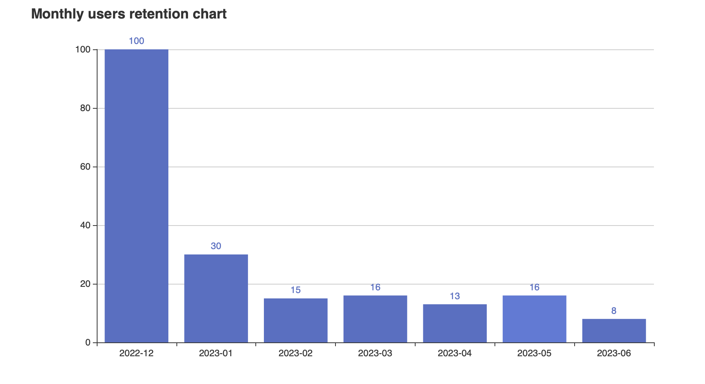

# Usage notes
The chart is rendered and available for view in the 'chart.html' file.



To build the code,

```shell
$ cd analyser
$ go build .
$ ./analyser
```
You get the following options:

```
Analyser is a tool for generating retention charts

Usage:

	./analyser <command>

The commands are:

	ingest      ingest "inferences.json" file in current directory
				into a SQLite database by the name of "records.db"

	query       query database for user retention related information
				and save into a JSON file named "retention_percentages.json"

	chart       chart monthly retention diagram into a file
				called "retention.png"

	demo		perform ingestion, querying and charting in sequence.

```
Choose the relevant command to perform each step. 

# Development Notes
## Understanding the data
It's a fairly large JSON file, with 200,000+ records. I used OctoSQL to query the shape of the data, and had the following observations:

- Schema was stable throughout
- Timestamps are in random order
	- Some timestamps are noisy, from year 1970

## Ingestion strategy
Since the schema is stable, and the query for retention charts is fairly involved, it made sense to ingest into a data store with expressive querying.

However, I wanted to the setup to be simple, so I went with SQLite.

The ingested data is stored in the file `records.db` and can be queried like so:

```
$ sqlite3 records.db
SQLite version 3.39.5 2022-10-14 20:58:05
Enter ".help" for usage hints.
sqlite> select * from inferences limit 5;
1|1|DeforumSD|dc158e8add22da7690cd35efe6f1c0ef6a43932868b8958c316a85c95f34e612|e02d31832fdba9afd55b6e2107e097124b7ddc28d6e6eac524f5afb42d19cc6b|2023-03-05 21:17:17.679325+00:00
2|1|DeforumSD|f4ccb9bda8dd1de76c9ca279e16a2a99606f65f885d83ee4fd4498c93eaf5892|e02d31832fdba9afd55b6e2107e097124b7ddc28d6e6eac524f5afb42d19cc6b|2023-03-05 21:18:00.957005+00:00
3|1|DeforumSD|8acb002ac4d5185a4333486dc8e6a1d38d89ef7ec7b8fe0829f193fc815f9d2d|e02d31832fdba9afd55b6e2107e097124b7ddc28d6e6eac524f5afb42d19cc6b|2023-03-05 21:18:24.693359+00:00
4|1|DeforumSD|8a79563f0d60e8738bd0d6bf9a5a60e63cb46f9a8a5059580c36c10aa0527c16|e02d31832fdba9afd55b6e2107e097124b7ddc28d6e6eac524f5afb42d19cc6b|2023-03-05 21:17:57.277849+00:00
5|1|DeforumSD|df848e52c0a00279ebf805912f2b719486a16e347d55fdcea67735753775f130|e02d31832fdba9afd55b6e2107e097124b7ddc28d6e6eac524f5afb42d19cc6b|2023-03-05 21:18:05.409089+00:00
sqlite>
```

### Challenges
    - Timestamps didn't come with timezone data, so hard to be parsed by giving a format string
    - Noisy timestamps had to be removed
    - `run_id` is not unique, leading to a dedicated autonumbering primary key

### Optimisations
Sequential insertion was taking about 44s on my machine. That felt excessive. Batching into 500 records per query reduced time to ~4s.

## Querying
A typical query for getting user retention looked like so:

```SQL
SELECT COUNT(DISTINCT user_id)
FROM inferences
WHERE user_id IN (
    SELECT user_id
    FROM inferences 
    WHERE strftime('%Y-%m', timestamp) = '2022-12'
    )
AND
    user_id IN (
    SELECT user_id
    FROM inferences
    WHERE strftime('%Y-%m', timestamp) = '2023-01'
    );
```

I stored the month string and percentage count in separate arrays as opposed to a map since order of keys while iteration in Golang is not reliable, and the chart is order sensitive.

## Charting
I used a simple library called [go-echarts](https://github.com/go-echarts/go-echarts).

## Anonymity
I wasn't sure what to do about the anonymity field. The number of recurring users is so small that it did not seem like it would provide value. However, with the way that the system is setup, future increase in usage should make querying regarding that fairly easy.

## LLM use
I used Claude and ChatGPT fairly regularly throughout the process, but had to mostly rewrite the code it produced. I learnt about OctoSQL via Claude, and that helped me early on. Learning to use go-echarts with these tools was ineffective, reading samples provided by the author was much more succint.
